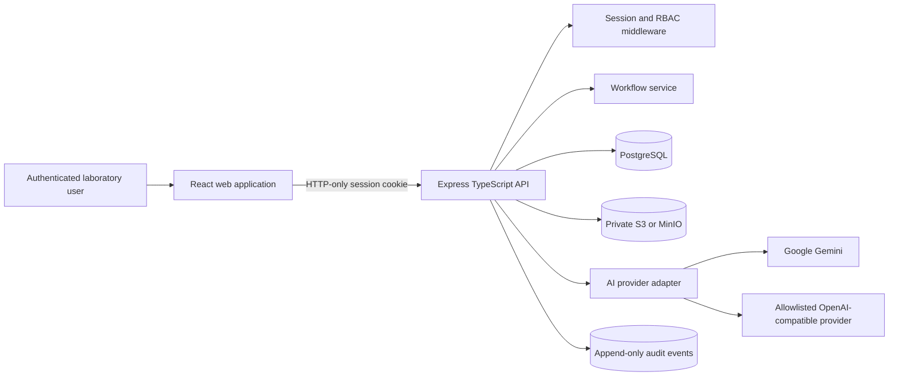

# Architecture

## Trust boundaries

- The browser never decides identity or authority.
- The server obtains role and organisation from a database-backed session.
- Every case query is organisation-scoped.
- Image content is untrusted until magic-byte detection, decoding and
  normalisation complete.
- Provider output is untrusted until schema validation succeeds.
- AI output cannot finalise a case.
- API keys are encrypted and excluded from responses and logs.

## Data ownership

PostgreSQL is the only source of truth for workflow and metadata. Private
object storage is the only source of truth for image bytes. Provider responses
are stored as validated, redacted analysis records.

## Failure behaviour

- Missing provider: analysis record `NOT_RUN`.
- Provider or schema failure: analysis record `FAILED`.
- Invalid image: request rejected before storage.
- Object-store write followed by database failure: object is deleted.
- Database soft deletion followed by object-store failure: image remains hidden
  and the cleanup failure is logged.
